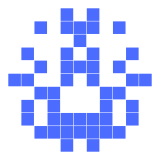
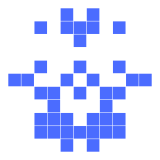
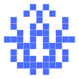
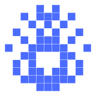
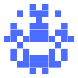

# Avatars

Avatars are the little symmetric pixel grid that sits next to each name. They
are derived deterministically from the name's internal value, so the same name
always shows the same avatar, and they double as a quick visual check that
you've got the right domain.

## How an avatar is made

Every name has a fixed 48-bit internal value (the same permuted value the name
string is encoded from). The avatar is simply that value drawn on a grid —
nothing random, nothing stored.

1. **48 bits = 6 columns × 8 rows.** The value is read as 6 source columns of
   8 pixels each.
2. **The 6 columns mirror to 11.** Each column is repeated left-to-right, so a
   pixel near the left edge also lights its mirrored pixel on the right. 6
   source columns become 11 drawn columns (6·2−1; the centre column is its own
   mirror).
3. **A circle silhouette picks which cells the 48 bits fill.** The 11×11 grid
   is shaped like a rounded disc — 2 cells wide at the very top and bottom,
   growing to 4, then 5, and the middle row stretches across all 6. Reading
   the 48 bits row-major over this silhouette gives the pattern; here it is
   (each `[#]` is a cell the silhouette fills, `[ ]` is outside the avatar):

```
[ ][ ][ ][ ][#][#][#][ ][ ][ ][ ]
[ ][ ][#][#][#][#][#][#][#][ ][ ]
[ ][#][#][#][#][#][#][#][#][#][ ]
[ ][#][#][#][#][#][#][#][#][#][ ]
[ ][#][#][#][#][#][#][#][#][#][ ]
[#][#][#][#][#][#][#][#][#][#][#]
[ ][#][#][#][#][#][#][#][#][#][ ]
[ ][#][#][#][#][#][#][#][#][#][ ]
[ ][#][#][#][#][#][#][#][#][#][ ]
[ ][ ][#][#][#][#][#][#][#][ ][ ]
[ ][ ][ ][ ][#][#][#][ ][ ][ ][ ]
```

   Because the disc is left-right symmetric, the bits only need to describe
   its left half — each source pixel fills its cell **and** the mirror on the
   right. (The `[#]`s above are the filled mirrors; the bottom three rows are
   where the corners of a plain 6×8 block would have been pushed out to.)

Per bit, that means: a bit whose source cell is on the **centre column** turns
on **1 pixel**; every other bit turns on **2 pixels** (itself + the mirror).
The SVG is an 11×11 grid of squares (25 px cells, centred, single fill
colour).

Because the 48 bits map one-to-one onto the lit pattern, **no two different
names ever share an avatar** — they can only *look* similar.

## How close avatars can be

One changed bit = 1–2 pixels (~1.8 pixels per bit on average), so avatars `d`
bits apart differ by roughly `2·d` pixels. Here is how close the closest
*registered* avatar gets to yours (`mafojefo-logivada`, ordinal 0) as the
registry fills — each one is a real avatar found by scanning the actual
ledger:

| milestone | name (ordinal) | hidden pixels | avatar |
|---|---|---|---|
| yours | `mafojefo-logivada` (0) | — |  |
| after ~200k | `lufihugo-lamihafa` (199,229) | 8 bits / 14 px |  |
| after ~3.5M | `lubojido-zisivava` (3,470,688) | 7 bits / 13 px |  |
| after ~15M | `zufojegu-gotivoza` (15,368,224) | 6 bits / 9 px |  |
| after ~24M | `mafojasu-lopivada` (23,759,741) | 5 bits / 8 px |  |

The closest doppelgänger creeps closer only very slowly — a full year of
registrations buys just a few pixels, and a truly confusing twin (≤1–2 bits)
is expected only around ~240 billion names (~11,000 years) or beyond the cap.
Every avatar stays different by at least one pixel.

## Why aren't near-identical pairs simply impossible?

The registry only ever uses 2^40 of the 2^48 values — plenty of spare room — so
it's tempting to think avatars could be guaranteed far apart. They can't: the
48-bit value is a scrambled bijection over the *whole* 2^48 space, not a
"40 payload + 8 spare bits" encoding. How close the nearest avatar gets is set
by how many registered values happen to land within a few bits of yours.
Combined with the name-level lookalike resistance in [names.md](./names.md), a
would-be impersonator needs both a near-identical name *and* a near-identical
avatar, and neither comes within reach for the foreseeable future.