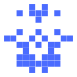

# Avatars

Avatars are the little symmetric pixel grid that sits next to each name. They
are derived deterministically from the name's internal value, so the same name
always shows the same avatar, and they double as a quick visual check that
you've got the right domain.

## How an avatar is made

1. the name's 48-bit value (the same permuted value the string is encoded
   from) is read as 48 source pixels,
2. the 48 pixels are laid into a circle silhouette — 6 mirrored columns wide,
   11 rows tall, rounded at top and bottom (`mns::avatar`),
3. each source pixel is mirrored left-to-right, so the left half determines
   the whole shape.

That means one bit of the value turns on one pixel in the left half and its
mirror on the right. Two names with values a few bits apart therefore have very
similar avatars — which is what matters for phishing (see below).

**No two names share an avatar.** A different value always lights a different
set of pixels ([`mns::avatar`]). Two avatars can only *look* similar.

## How close avatars can be

One changed bit flips **1 pixel** (down the centre column) or **2 pixels**
(everywhere else, mirrored) — on average **~1.8 pixels per bit**. So avatars
`d` bits apart differ by roughly `2·d` pixels. Measured over the shipped pool
tables, for a given name:

| your avatar vs the rest | first registered avatar ≤d bits off (at ~N registered names) | at the 1T cap: avatars ≤d bits from yours |
|---|---:|---:|
| ≤1 bit (~2 px) | ~6×10¹² — beyond the cap | ~0.2 (≈1 name in 6 has one) |
| ≤2 bits (~4 px) | ~2×10¹¹ | ~4.6 (near-certain) |
| ≤3 bits (~5 px) | ~2×10¹⁰ | ~72 |
| ≤4 bits (~7 px) | ~10⁹ | ~830 |
| ≤5 bits (~9 px) | ~10⁸ | ~7,500 |
| ≤6 bits (~11 px) | ~2×10⁷ | ~55,000 |

**Eventually always differ by at least 1 pixel** (injectivity), and in practice
a given name's nearest registered avatar stays several pixels away until very
deep in the registry: among the **first 3 million** registered names, the
closest avatar to ordinal 0 (`mafojefo-logivada`) is `lufihugo-lamihafa`
(ordinal 199,229), which differs by **8 bits / 14 pixels**:

| `mafojefo-logivada` (ordinal 0) | `lufihugo-lamihafa` (ordinal 199,229) |
|---|---|
|  |  |

## Why aren't near-identical pairs simply impossible?

The registry only ever uses 2^40 of the 2^48 values — a lot of spare room — so
it is tempting to think avatars could be guaranteed far apart. They can't:
the 48-bit value is a scrambled bijection over the *whole* 2^48 space, not a
"40 payload + 8 spare bits" encoding. The nearest registered avatar is decided
by how many registered values happen to sit within a few bits, which is exactly
the table above: a ~2-pixel twin is rare but possible (~1 name in 6 at the
cap), a ~4-pixel twin is the norm, and both need thousands of years of
registrations to appear first. Combined with the name-level lookalike
resistance in [names.md](./names.md), a would-be impersonator needs both a
near-identical name *and* a near-identical avatar — and neither gets within
reach for the foreseeable future.